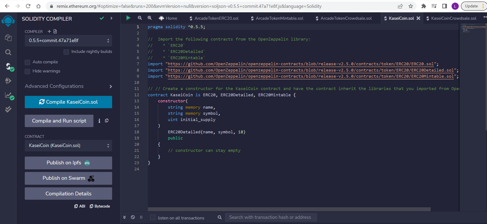
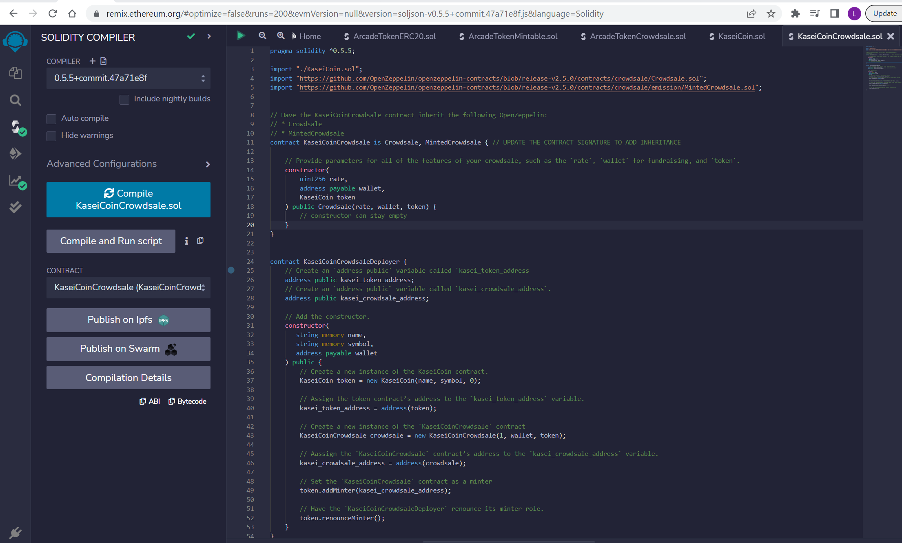
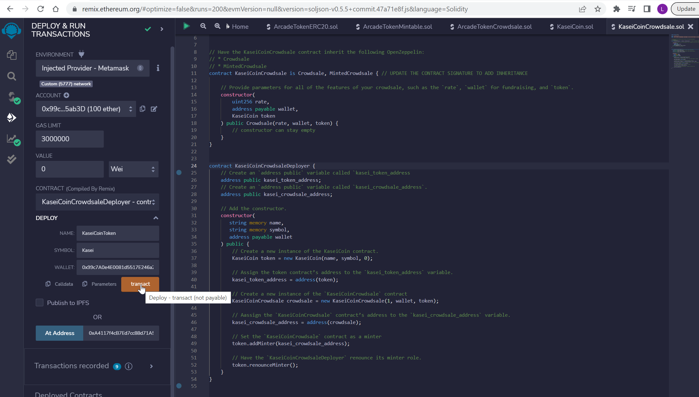
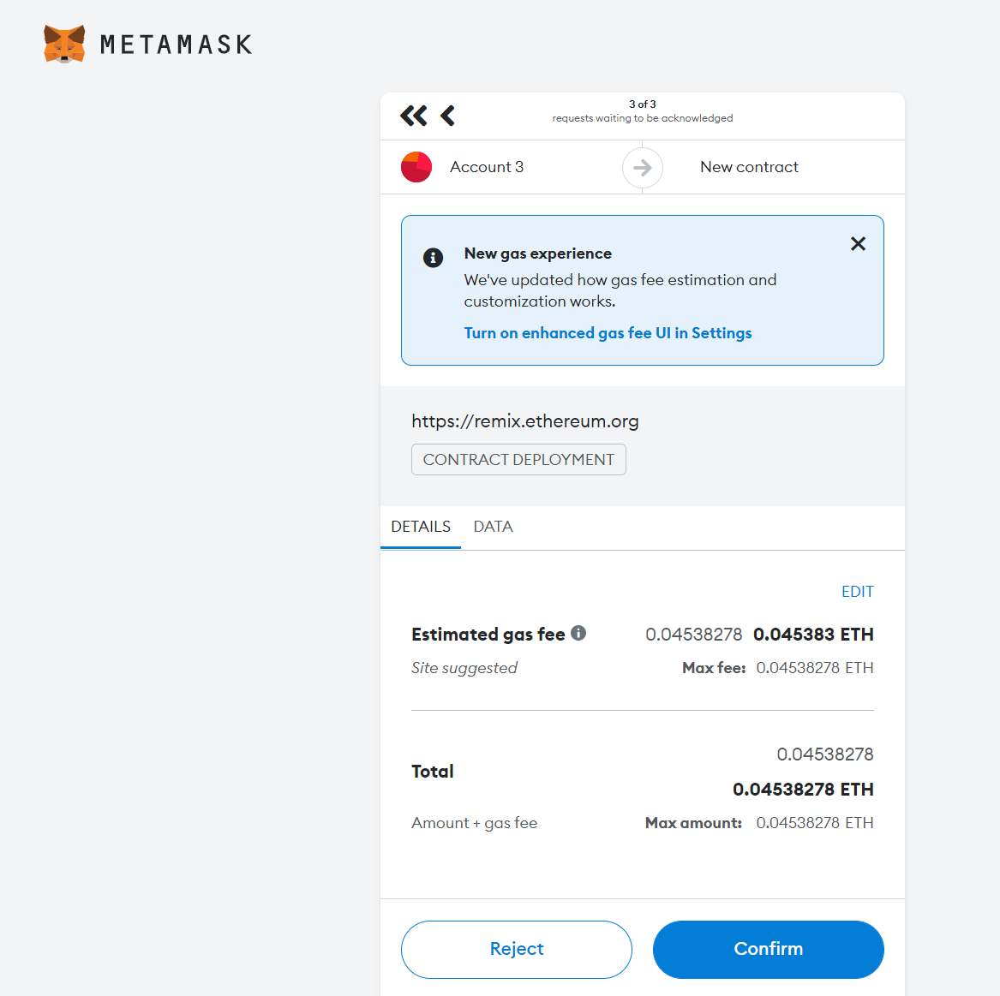
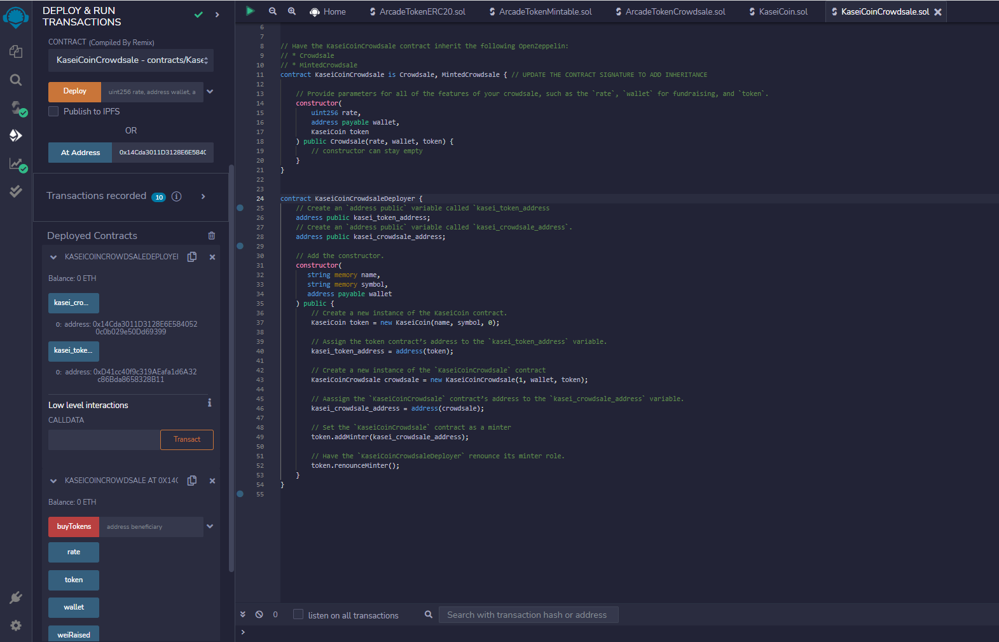
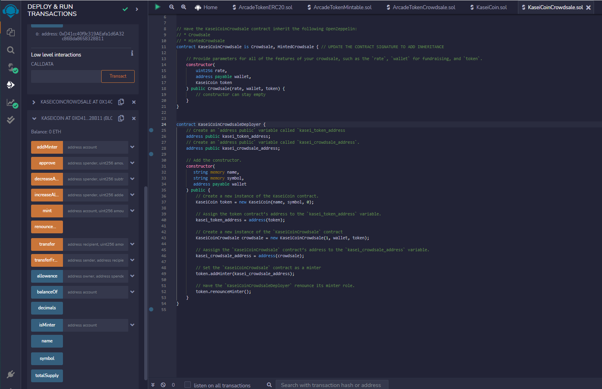
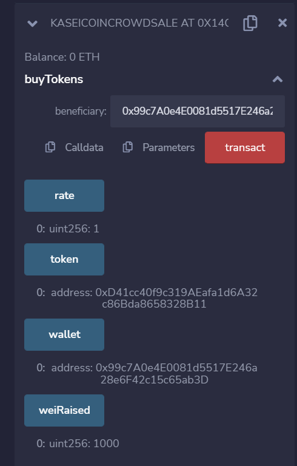
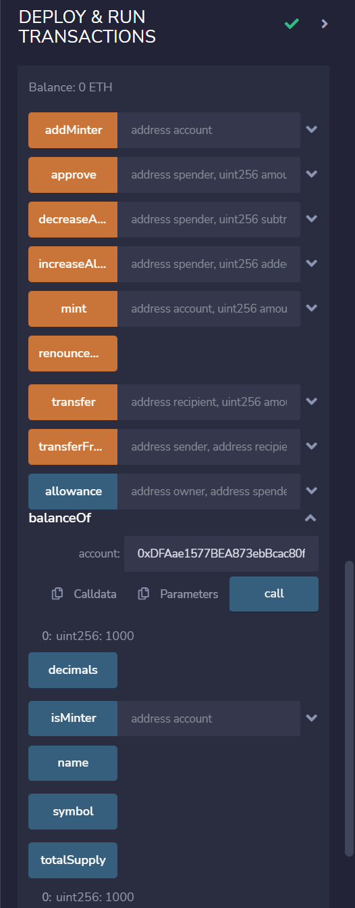
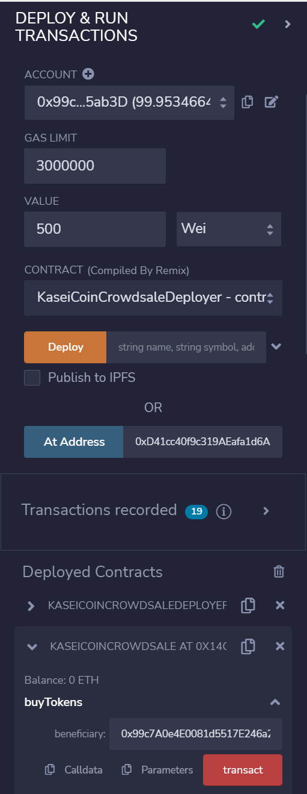
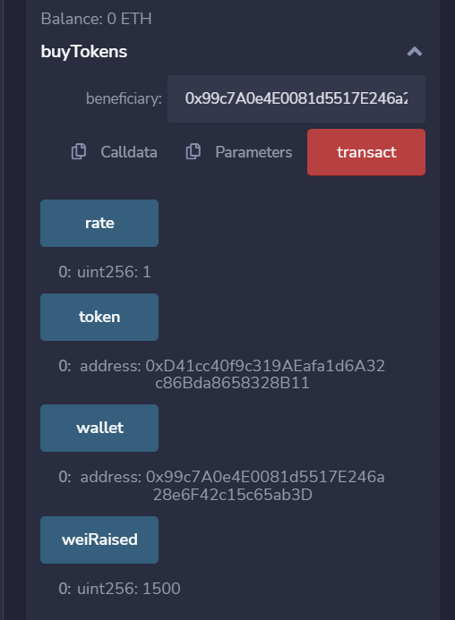

# Blockchain_Module4_Challenge

### Evaluation Evidence 
Compilation screenshots for KaiseiCoin contract

Compilation screenshot for KaiseiCoinCrowdsale contract

### Deployment Procedure
1. Deploy KaseiCoinCrowdsaleDeployer contract with Name, Symbol and Wallet

2. Confirm in the MetaMask wallet

3. In the deployed KaseiCoinCrowdsaleDeployer, copy the kasei_crowdsale_address, and switch to KaseiCoinCrowdsale contract by ticking At Address to deploy KaseiCoinCrowdsale contract

4. In the deployed KaseiCoinCrowdsaleDeployer, copy the kasei_token_address, and switch to KaseiCoin contract by ticking At Address to deploy the KaseiCoin contract

### Test Results
1. In the first transaction, I set up 1000 wei in the value and ticked the buyTokens as following, which generated weiRaised 1000 in the KaserCoinCrowdsale contract.

Also checked the balanceOf = 1000 and totalSupply = 1000 in the KaserCoin contract

2. In the second transaction, I set up 500 wei in the value and ticked the buyTokens again.

The weiRaised in total will be 1500 (including 1000+ 500) as expected

